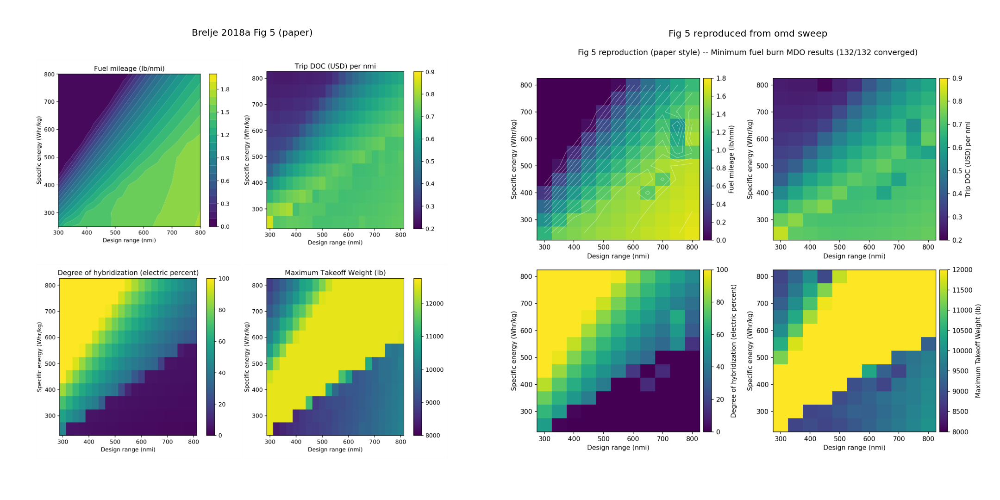

# the-hangar

Open-source MCP servers and CLI tools for aerospace design and MDO, built for AI agents.

**[mcp.lakesideai.dev](https://mcp.lakesideai.dev/)** -- hosted servers ready to connect.

## Hosted servers

Public instances are available at `mcp.lakesideai.dev`. Authentication uses Keycloak OIDC (browser login on first connection).

| Server | Endpoint | Description |
|--------|----------|-------------|
| OAS | `https://mcp.lakesideai.dev/oas/mcp` | Aerostructural analysis and optimization of lifting surfaces. Couples VLM aerodynamics with finite-element structures for wing design. |
| OCP | `https://mcp.lakesideai.dev/ocp/mcp` | Aircraft conceptual design and mission analysis. Fuel burn, takeoff performance, and battery SOC for conventional and hybrid-electric architectures. |
| PYC | `https://mcp.lakesideai.dev/pyc/mcp` | Gas turbine engine cycle analysis. Design-point sizing and off-design performance with full thermodynamic station modeling. |
| OMD | `https://mcp.lakesideai.dev/omd/mcp` | General-purpose OpenMDAO plan runner. Authors and runs YAML optimization plans through a factory registry, composing the other tools into multi-disciplinary studies with a full provenance graph. |

`hangar-evt` (eVTOL sizing and mission-energy analysis, wrapping evtolpy) is included in the repo but **not yet hosted** -- run it locally via `evt-cli`/`evt-server` (see [Packages](#packages)).

### Connecting

**Claude Code:**

```bash
claude mcp add --transport http oas https://mcp.lakesideai.dev/oas/mcp
claude mcp add --transport http ocp https://mcp.lakesideai.dev/ocp/mcp
claude mcp add --transport http pyc https://mcp.lakesideai.dev/pyc/mcp
claude mcp add --transport http omd https://mcp.lakesideai.dev/omd/mcp
```

**claude.ai:** Settings > Integrations > Add MCP Server, then enter the endpoint URL.

## Case studies

End-to-end engineering workflows executed through The Hangar. Each study ships with plots, an N2 diagram, a provenance graph, and the decision log.

| Study | What it demonstrates | Tools | Live |
|-------|----------------------|-------|------|
| [Brelje 2018a reproduction](https://mcp.lakesideai.dev/studies/brelje-2018a/) | King Air twin series-hybrid MDO over range x battery specific energy. Reproduces Figs 5 and 6 of [Brelje & Martins 2018](https://doi.org/10.2514/6.2018-4979). | OCP + omd (Lane B plan) | [link](https://mcp.lakesideai.dev/studies/brelje-2018a/) |
| [Regional 28m wing optimization](https://mcp.lakesideai.dev/studies/reg28m-opt-refined/) | Aerostructural CD-min on an E190-class wing with structural-mass cap. 28 SLSQP iterations, L/D=22.6 at CL=0.5. | OAS aerostruct + omd | [link](https://mcp.lakesideai.dev/studies/reg28m-opt-refined/) |



*Brelje 2018a Fig 5 (fuel + MTOW/100 objective): paper (left) vs omd Lane B reproduction (right), 11x12 paper-correct grid (132/132 converged). Mixed-objective agreement under 2 % at all three published Table 4 reference cells.*

## Local setup

Clone and install, then start Claude Code from the repo root. The `.mcp.json` already configures all four servers as local MCP connections.

```bash
git clone https://github.com/muroc-aero/the-hangar && cd the-hangar
uv sync
claude
```

Claude Code will automatically start the OAS, OCP, PYC, and OMD servers via the `.mcp.json` config.

To also enable the CLI-guide skills (so you can run analyses without MCP, using `oas-cli`, `ocp-cli`, `pyc-cli`, `omd-cli` directly), sync the skills into `.claude/`:

```bash
bash scripts/sync-skills.sh
```

This copies the CLI-guide skills from each package into `.claude/skills/` where Claude Code picks them up. Re-run after pulling new changes.

## Packages

| Package | Namespace | Description | CLI |
|-----------|-----------|-------------|-----|
| `hangar-sdk` | `hangar.sdk` | Shared infrastructure -- provenance, response envelopes, validation, session management | -- |
| `hangar-oas` | `hangar.oas` | OpenAeroStruct aerostructural analysis server | `oas-cli`, `oas-server` |
| `hangar-ocp` | `hangar.ocp` | OpenConcept aircraft conceptual design and mission analysis server | `ocp-cli`, `ocp-server` |
| `hangar-pyc` | `hangar.pyc` | pyCycle gas turbine cycle analysis server | `pyc-cli`, `pyc-server` |
| `hangar-omd` | `hangar.omd` | General-purpose OpenMDAO plan runner -- YAML plans, factory registry, multi-tool composition, provenance graph | `omd-cli`, `omd-server` |
| `hangar-evt` | `hangar.evt` | eVTOL aircraft sizing and mission-energy analysis (wraps evtolpy). Not yet hosted -- local CLI/MCP only. | `evt-cli`, `evt-server` |
| `hangar-results-reader` | `hangar.results_reader` | Read-only access to omd run results for downstream consumers (e.g. dashboards) | -- |
| `hangar-viewer` | `hangar.viewer` | Unified provenance viewer for Hangar tool servers | `hangar-viewer` |

`packages/range-safety/` is a git submodule pointing at the separate
`range-safety` repo (range-safety validators and study dashboard); it is
absent on a plain clone and not required for any of the other packages.

These packages are not on PyPI. Install from the repo:

```bash
cd the-hangar
uv sync
```

This installs all packages in development mode. To install a subset into another project:

```bash
uv pip install -e packages/sdk -e packages/oas
```

## Project layout

```
the-hangar/
├── packages/
│   ├── sdk/                    # hangar-sdk
│   │   └── src/hangar/sdk/
│   ├── oas/                    # hangar-oas (OpenAeroStruct)
│   │   └── src/hangar/oas/
│   ├── ocp/                    # hangar-ocp (OpenConcept)
│   │   └── src/hangar/ocp/
│   ├── pyc/                    # hangar-pyc (pyCycle)
│   │   └── src/hangar/pyc/
│   ├── omd/                    # hangar-omd (OpenMDAO plan runner)
│   │   └── src/hangar/omd/
│   ├── results-reader/         # hangar-results-reader (omd results access)
│   │   └── src/hangar/results_reader/
│   ├── range-safety/           # submodule (absent on plain clones)
│   └── viewer/                 # hangar-viewer (provenance viewer)
│       └── src/hangar/viewer/
├── skills/                     # cross-tool workflow skills
├── upstream/                   # local clones of upstream repos (git-ignored)
├── docker/
└── scripts/
```

Every package shares the `hangar` Python namespace ([PEP 420](https://peps.python.org/pep-0420/) implicit namespace packages). Each is independently installable and pulls in `hangar-sdk` automatically.

**Important:** there must be no `__init__.py` in `src/hangar/` — only at the leaf level (e.g. `src/hangar/oas/__init__.py`). This is what makes the namespace work across separately installed packages.

## Development

```bash
# Clone and set up
git clone https://github.com/muroc-aero/the-hangar && cd the-hangar
uv sync

# Run an MCP server
uv run oas-server
uv run ocp-server
uv run pyc-server
uv run omd-server

# Run a CLI
uv run oas-cli interactive
uv run ocp-cli interactive
uv run pyc-cli interactive
uv run omd-cli run plan.yaml --mode analysis

# Run tests (all packages; skip slow integration tests with -m "not slow")
uv run pytest
uv run pytest -m "not slow"
uv run pytest packages/omd/tests/   # by package

# Docker
docker compose -f docker/docker-compose.yml up --build
```

## Adding a new tool

The full process is documented in the `/new-tool` skill (see `skills/new-tool/SKILL.md`). The steps at a high level:

1. **Scope the tool** -- study the upstream source to determine which analyses to expose, identify golden tests and critical demo examples
2. **Scaffold the MCP server** -- create `packages/<tool>/` following the `oas/` structure, using the SDK for provenance, envelopes, validation, and artifacts. No `__init__.py` in `src/hangar/`
3. **Integrate the viewer** -- wire up the provenance viewer daemon thread and env vars matching the other packages
4. **Set up the CLI** -- create `<tool>-cli` and `<tool>-server` console_scripts exposing all MCP tools through interactive, one-shot, and script modes
5. **Verify auth and access** -- confirm OIDC auth, transport selection, and env var naming match the other packages
6. **Run full integration tests** -- exercise every tool via CLI, verify response envelopes, validation, visualization, and provenance graph
7. **Set up deployment** -- add to `docker-compose.yml`, `Caddyfile`, document Keycloak setup in `packages/<tool>/DEPLOY.md`, add to `.mcp.json`
8. **Create a `<tool>-cli-guide` skill** -- following the `oas-cli-guide` structure with modes, commands, provenance, and example workflows

## Contributing

We welcome contributions of MCP server wrappers for other engineering tools. The SDK provides shared infrastructure for response envelopes, provenance tracking, validation, and artifact storage, so you can focus on the tool-specific logic.

Check the [issues](https://github.com/muroc-aero/the-hangar/issues) and [discussions](https://github.com/muroc-aero/the-hangar/discussions) on GitHub to see what tools are being considered, propose new ones, or pick up an existing request.

## References

This project wraps the following open-source tools. If you use them in published work, please cite the original papers.

**OpenAeroStruct** -- [mdolab/OpenAeroStruct](https://github.com/mdolab/OpenAeroStruct)

> Jasa, J. P., Hwang, J. T., and Martins, J. R. R. A., "Open-source coupled aerostructural optimization using Python," *Structural and Multidisciplinary Optimization*, Vol. 57, No. 4, 2018, pp. 1815--1827. [doi:10.1007/s00158-018-1912-8](https://doi.org/10.1007/s00158-018-1912-8)

**OpenConcept** -- [mdolab/openconcept](https://github.com/mdolab/openconcept)

> Brelje, B. J. and Martins, J. R. R. A., "Development of a Conceptual Design Model for Aircraft Electric Propulsion with Efficient Gradients," AIAA/IEEE Electric Aircraft Technologies Symposium, AIAA Paper 2018-4979, Cincinnati, OH, 2018. [doi:10.2514/6.2018-4979](https://doi.org/10.2514/6.2018-4979)

**pyCycle** -- [OpenMDAO/pyCycle](https://github.com/OpenMDAO/pyCycle)

> Hendricks, E. S. and Gray, J. S., "pyCycle: A Tool for Efficient Optimization of Gas Turbine Engine Cycles," *Aerospace*, Vol. 6, No. 87, 2019. [doi:10.3390/aerospace6080087](https://doi.org/10.3390/aerospace6080087)

**evtolpy** -- [starbelt/evtolpy](https://github.com/starbelt/evtolpy)

> Nguyen, K. D., Hogge, D., Riris, J., Sarojini, D., and Denby, B., "Autonomous Battery Units as an Enabling Technology for Urban Air Mobility," AIAA SciTech 2026 Forum, AIAA Paper 2026-1713, 2026. [doi:10.2514/6.2026-1713](https://doi.org/10.2514/6.2026-1713)

## License

See [LICENSE](LICENSE).
